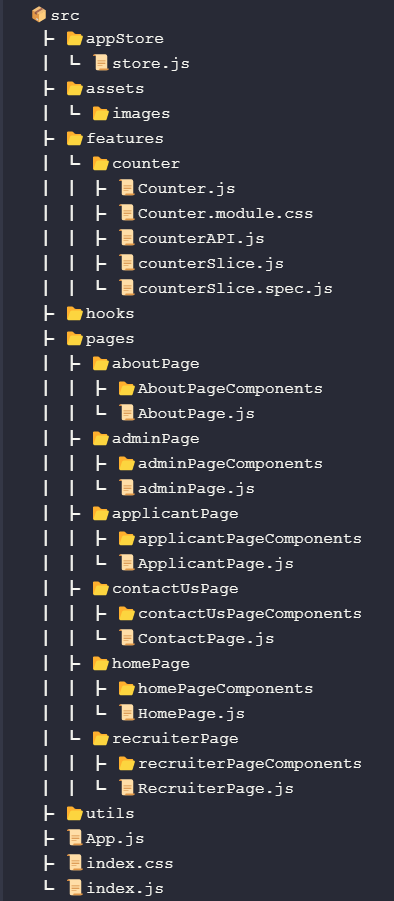

# Hierarchy of talent-recruiter web app

# Overview of Talent Recruiter

TalentRecruiter is a job hunting platform where users can find the desired jobs. In this web application, we provide different kinds of jobs from multiple companies. Job seekers can post resumes, portfolios, and work-related profiles on many Internet job boards. Employers and recruiters can look through such information when searching for candidates to hire.

# Feature of the project: 

## 🚀Home page:

The home page will include the features Navbar, dark and light mode, Banner section, job trading where user can find latest jobs, customer review where user can see our all customer brand name. Feature job section, subscribe section, blog section, footer section

## 🚀Category:

This feature will find all category names ex. Finance, software and IT, UI/UX design so on.

## 🚀Job Listing:

In the section, we will show the Job list. It will be related to the category at the bottom that will show the pagination system.

## 🚀Job detail page:

In this section, users can see job detail with job deadlines, job summaries, employer names so on.

## 🚀Login and Registration:
Users can log in and register using social media and custom email.

## 🚀About page:
This page will show our mission and vision. The team members who are behind the scene working, the founder's information, and what we achieve so far.

## 🚀Admin Dashboard:
Admin can manage all users and jobs. Admin can also review the job post if he approved then it will publish. Admin can customize some of the UI.

## 🚀Recruiter Dashboard:

The recruiter can post their job in detail. He can update his profile if anyone applies for his/her job post he can see the applicant's resume and profile.

## 🚀Applicant dashboard:

Applicant can see their applied job in detail and they can cancel the applied job and also able to update his/her own profile.

## 🚀CV builder (optional):
Applicant builds their own resume using his/her information for example. Education, skill, if have experience, project/works with detail, Full name, and job title.

## 🚀Job search with keyword filtering (optional):
This feature will allow us to implement debounce technique searching with the most popular keyword filtering.

# New technology explanation: 

## 🤷‍♂️Why we are Redux selected?
Redux is most useful in cases when we have large amounts of application states that are needed in many places in the app. The app state is updated frequently. The logic of updating that state may be complex. The app has a medium or large-sized codebase and might be worked on by many people. Redux is more flexible we don’t need to Props drilling without component architect changes to manage the states. Not only that it also includes Predictable behavior, Centralized, and Debuggable above the reason we selected Redux.

## 🔥Our Main Goal Using Redux:
While it’s mostly used as a state management tool with React, we can use it with any other JavaScript framework or library. It’s lightweight at 2KB (including dependencies), so we don’t have to worry about it making our application’s asset size bigger.
With Redux, the state of our application is kept in a store, and each component can access any state that it needs from this store. So, our main goal is globally managing application states and updating the UI optimistically.

### Big ♨️Thumbs goes to 
* [Anik Das](http://localhost:3000), 
* [Fajla Rabby Khan ](http://localhost:3000), 
* [Ahasan Habib Sany](http://localhost:3000),
* [Nayim Hossen](http://localhost:3000),
* [Rasel Mahmud](https://github.com/raselmahmud22)

